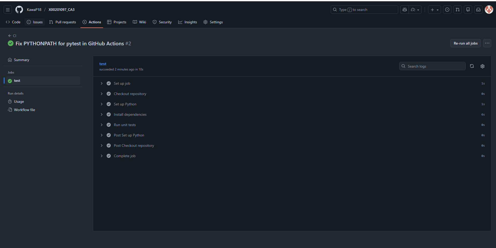
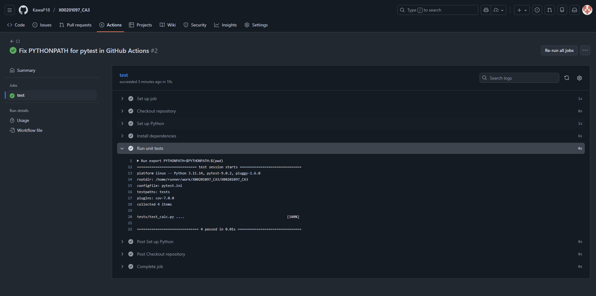
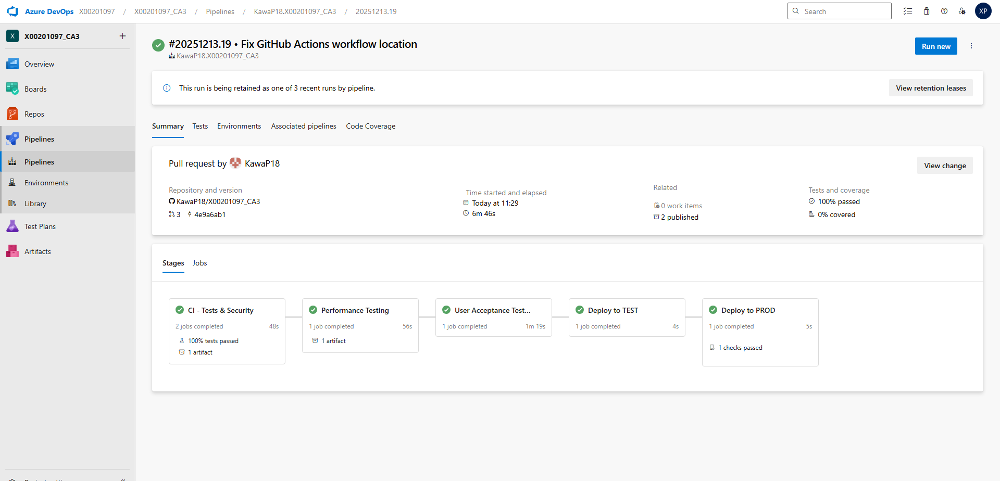
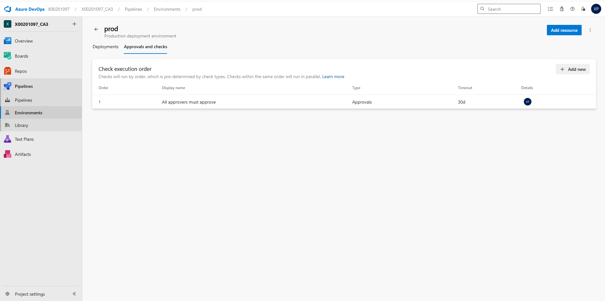

# X00201097_CA3 – CI/CD Pipeline Implementation
---

## Overview
This project shows the design and implementation of a complete CI/CD pipeline using GitHub Actions for Continuous Integration and Azure DevOps Pipelines for Continuous Deployment.

The objective of CA3 is to go furthere than basic CI (implemented in CA2) and show industry standard DevOps practices, including:

- Automated testing and validation

- Static code analysis and security scanning

- Performance testing

- User Acceptance Testing (UAT)

- Multi-stage deployments

- Environment-based approval gates for production

A simple Python calculator application which was used in CA2 is used for the pipeline. The application itself has very little code so that the focus stays on pipeline architecture, automation and governanceinstead of application complexity.

---
## Repository Structure
The repository follows a clean, industry style structure that separates application code, tests, pipeline configuration and automation scripts.

### Key Directories and Files

- .github/workflows/ci.yml – GitHub Actions CI workflow

- calculator/ – Python application source code

- tests/ – Pytest unit tests

- uat_tests/ – Selenium User Acceptance Tests

- loadtest.js – k6 performance testing script

- pytest.ini – Pytest configuration file

- azure-pipelines.yml – Azure DevOps multi stage CD pipeline

- README.md – Technical documentation for CA3

This structure makes sure that automation tools can find the correct components and that responsibilities are clearly separated.
---
## Technologies Used
- Python 3.x

- Pytest validates functional correctness through automated testing

- Pylint enforces coding standards and detects maintainability issues

- Bandit introduces security scanning early in the pipeline (shift-left security)

- k6 demonstrates performance and load testing as part of CI/CD

- Selenium provides UI-level automation and end-to-end validation

- GitHub Actions enables fast, developer-focused CI feedback

- Azure DevOps Pipelines enables governed, multi-stage deployments

- Azure DevOps Environments – Deployment governance and approvals

These tools work together to build a pipeline with several layers of quality checks, not just one type of test.
---
## Local Development Setup
To run the project locally, the following steps can be followed:

1. Clone the repository:
   ```bash
   git clone https://github.com/KawaP18/X00201097_CA3.git
   cd X00201097_CA3
    ```
2. (Optional) Create and activate a Python virtual environment.
   ```bash
   python -m venv venv
   source venv/bin/activate   # Linux/macOS
   venv\Scripts\activate      # Windows
   ```

3. Install the required dependencies:
   ```bash
   pip install -r requirements.txt
   ```
4. Run the unit tests:
   ```bash
   pytest
   ```
These are the same commands the CI pipeline runs automatically.

---
## Application Features
The app in this project is a simple Python calculator. It can do the following:

- Addition
- Subtraction
- Multiplication

Automated unit tests check all features.
You do not need to test anything by hand.

---
## CI Pipeline Implementation
GitHub Actions handles Continuous Integration. The workflow starts:

- On every push to the `dev` branch

- On pull requests targeting the `main` branch

This setup checks all code changes automatically before they are merged.


CI Workflow Configuration (`ci.yml`)
```yaml
name: CI

on:
  push:
    branches:
      - dev
  pull_request:
    branches:
      - main

jobs:
  test:
    runs-on: ubuntu-latest

    steps:
      - name: Checkout repository
        uses: actions/checkout@v4

      - name: Set up Python
        uses: actions/setup-python@v5
        with:
          python-version: "3.11"

      - name: Install dependencies
        run: |
          python -m pip install --upgrade pip
          pip install -r requirements.txt

      - name: Run unit tests
        run: |
          export PYTHONPATH=$PYTHONPATH:$(pwd)
          pytest

```
### Explanation
The `ci.yml` file sets the rules that every code change must follow.

Key responsibilities of this workflow include:

- Provisioning a clean execution environment
- Installing dependencies deterministically
- Running automated tests
- Failing fast when errors are detected

Setting `PYTHONPATH` configuration resolves a common CI issue where module imports succeed locally but fail in isolated runners. Finding and fixing issues like this is essential in real world DevOps roles.

### Successful CI Execution
The screenshot below shows a successful GitHub Actions run, where all CI steps complete without errors.



---
## Automated Unit Testing
Unit tests are executed using Pytest as part of the CI workflow.

### What This Confirms

- Tests are discovered correctly

- All application functionality is validated

- CI fails immediately if tests break

The following screenshot shows successful unit test execution within the pipeline.
This shows that all calculator functions are checked automatically.



### Pytest Configuration `(pytest.ini)`
```ini
[pytest]
testpaths = tests
```

### Explanation

- Restricts Pytest discovery to unit tests only

- Prevents Selenium UAT tests from running during CI

- Ensures fast and focused feedback
---
## Azure DevOps CI/CD Pipeline

Continuous Deployment is implemented using Azure DevOps Pipelines.

### Pipeline Stages

1. CI – Tests & Security

   - Unit tests

   - Pylint

   - Bandit security scan

2. Performance Testing

   - k6 load testing

3. User Acceptance Testing

   - Selenium WebDriver tests

4. Deploy to TEST

5. Deploy to PROD

Each stage has to finish successfully before the next one starts.

The screenshot below shows a completed multi-stage pipeline run in Azure DevOps,
including CI, testing, and deployment stages.



### Azure Pipeline Configuration `(azure-pipelines.yml)`

```yaml
trigger:
- dev

pool:
  vmImage: 'ubuntu-latest'

stages:

# =========================
# CI STAGE — UNIT TESTS + SAST
# =========================
- stage: CI
  displayName: "CI - Tests & Security"
  jobs:

  - job: UnitTests
    displayName: "Run Pytest Unit Tests"
    steps:
    - task: UsePythonVersion@0
      inputs:
        versionSpec: '3.10'

    - script: |
        pip install -r requirements.txt
        export PYTHONPATH=$(System.DefaultWorkingDirectory)
        pytest --junitxml=unit-tests.xml
      displayName: "Install deps & run pytest"

    - task: PublishTestResults@2
      inputs:
        testResultsFiles: 'unit-tests.xml'
        testRunTitle: 'Unit Tests'
      condition: succeededOrFailed()

  - job: BanditScan
    displayName: "SAST - Bandit"
    steps:
    - task: UsePythonVersion@0
      inputs:
        versionSpec: '3.10'

    - script: |
        pip install bandit
        bandit -r calculator -f json -o bandit-report.json || true
      displayName: "Run Bandit scan"

    - publish: bandit-report.json
      artifact: security-report


# =========================
# PERFORMANCE TESTING — k6
# =========================
- stage: Performance
  displayName: "Performance Testing"
  dependsOn: CI
  condition: succeeded()
  jobs:
  - job: K6Tests
    displayName: "Run k6 load test"
    steps:
    - script: |
        sudo apt-get update
        sudo apt-get install -y ca-certificates gnupg
        sudo mkdir -p /etc/apt/keyrings
        curl -fsSL https://dl.k6.io/key.gpg | sudo gpg --dearmor -o /etc/apt/keyrings/k6.gpg
        echo "deb [signed-by=/etc/apt/keyrings/k6.gpg] https://dl.k6.io/deb stable main" | sudo tee /etc/apt/sources.list.d/k6.list
        sudo apt-get update
        sudo apt-get install -y k6
        k6 run loadtest.js --out json=perf-results.json
      displayName: "Execute k6 test"

    - publish: perf-results.json
      artifact: performance-results


# =========================
# UAT — SELENIUM
# =========================
- stage: UAT
  displayName: "User Acceptance Testing"
  dependsOn: Performance
  condition: succeeded()
  jobs:
  - job: SeleniumUAT
    displayName: "Run Selenium tests"
    steps:
    - task: UsePythonVersion@0
      inputs:
        versionSpec: '3.10'

    - script: |
        sudo apt-get update
        sudo apt-get install -y wget gnupg
        wget -q -O - https://dl.google.com/linux/linux_signing_key.pub | sudo apt-key add -
        sudo sh -c 'echo "deb [arch=amd64] http://dl.google.com/linux/chrome/deb/ stable main" >> /etc/apt/sources.list.d/google.list'
        sudo apt-get update
        sudo apt-get install -y google-chrome-stable
      displayName: "Install Chrome"

    - script: |
        pip install selenium
      displayName: "Install Selenium"

    - script: |
        python uat_tests/selenium_test.py
      displayName: "Run Selenium UAT"


# =========================
# DEPLOY TO TEST
# =========================
- stage: DeployTest
  displayName: "Deploy to TEST"
  dependsOn: UAT
  condition: succeeded()
  jobs:
  - deployment: DeployTestJob
    environment: Test
    strategy:
      runOnce:
        deploy:
          steps:
          - script: echo "Deploying to TEST environment"


# =========================
# DEPLOY TO PROD (APPROVAL)
# =========================
- stage: DeployProd
  displayName: "Deploy to PROD"
  dependsOn: DeployTest
  condition: succeeded()
  jobs:
  - deployment: DeployProdJob
    environment: Prod
    strategy:
      runOnce:
        deploy:
          steps:
          - script: echo "Deploying to PRODUCTION"

```

---

### Azure DevOps Pipeline Configuration – Explanation

The `azure-pipelines.yml` file sets up a multi-stage deployment pipeline. Each stage checks the build before letting it move forward.

### Multi-Stage Design and Execution Order

The pipeline has clear stages. Each one checks a specific part of the process.

A strict execution order is enforced using stage dependencies, meaning:

- A stage cannot start unless the previous stage succeeds
- Test failures immediately stop the pipeline
- Deployment stages are protected from unvalidated builds

This setup catches errors early so they do not reach later stages.

---

### Separation of Testing Responsibilities

Testing concerns are deliberately separated into independent stages:

- Unit testing and security scanning
- Performance testing
- User Acceptance Testing (UAT)

This separation improves:

- Clarity – each stage has a single responsibility
- Traceability – failures are easy to diagnose
- Efficiency – resource-intensive tests only run after basic checks pass

---

### Environment-Based Deployment Governance
Deployments are managed using Azure DevOps Environments rather than direct script execution. This allows:

- Environment-specific deployment tracking
- Centralised visibility of releases
- Manual approval gates for sensitive environments

A manual approval gate protects the Production environment. This means someone must approve before anything goes live.

The following screenshot shows the manual approval gate required before deploying
to the Production environment.



---

**Summary:**  
This pipeline shows a controlled and scalable way to handle Continuous Deployment. It balances automation with checks, like in real DevOps work.

---
## Performance Testing with k6
```javascript
import http from 'k6/http';
import { sleep } from 'k6';

export default function () {
  http.get('https://test.k6.io');
  sleep(1);
}
```
### Explanation
- Simulates HTTP load

- Validates pipeline performance stage

- Demonstrates non-functional testing integration
---
## User Acceptance Testing with Selenium
```python
from selenium import webdriver
from selenium.webdriver.chrome.options import Options

options = Options()
options.add_argument("--headless")

driver = webdriver.Chrome(options=options)
driver.get("https://example.com")
assert "Example Domain" in driver.title
driver.quit()

```
### Explanation

- Runs browser-based UI automation

- Executes in headless Chrome

- Demonstrates end-to-end testing in CI/CD
---
## Environment Setup and Configuration

Two Azure DevOps environments are used:

- Test – automatic deployment

- Prod – protected by approvals

This setup makes sure builds are promoted in a controlled way.

---
## Production Approval Gate

You need to approve production deployments by hand.

### Why This Matters

- Prevents accidental deployments

- Reflects real-world DevOps governance

---
## Branch Policies and Protection
The repository follows a two-branch strategy to support controlled development and deployment:

- `dev`: Used for active development and testing.
- `main`: Represents stable, production-ready code.

All changes are made and tested on the `dev` branch first. Use pull requests to merge into `main`, and make sure CI checks pass before deploying to production.

This method follows best practices. It keeps development work separate from production code and lowers the risk of breaking things.

---
## Testing Strategy
A layered testing strategy checks both the app and the pipeline. Each type of test runs in its own stage for clear separation and quick feedback.

The testing strategy includes:

- **Unit Testing**  
  Unit tests are written using Pytest to validate the calculator’s core functionality. These tests execute during the CI stage and provide immediate feedback on code changes.

- **Static Code Analysis**  
  Pylint is used to analyse code quality and enforce consistent coding standards.

- **Security Testing (SAST)**  
  Bandit performs Static Application Security Testing to identify common Python security issues early in the pipeline.

- **Performance Testing**  
  k6 is used to execute load and performance tests against a sample HTTP endpoint, demonstrating performance validation within the CI/CD pipeline.

- **User Acceptance Testing (UAT)**  
  Selenium WebDriver executes browser-based tests to validate UI-level automation and demonstrate realistic end-to-end testing capability.

By separating testing layers, it is easier to spot failures and each stage can focus on one thing.
Putting each test type in its own stage makes it easier to trace problems and isolate faults.
You can find failures quickly without affecting other parts of the pipeline.

---
## Environment Setup and Configuration
Two deployment environments are configured in Azure DevOps to support controlled application releases:

- **Test**: Used to validate deployments after all automated testing stages have completed.
- **Prod**: Represents the production environment and is protected by manual approval gates.

Azure DevOps manages these environments and the pipeline YAML points to them directly. This makes sure deployments know which environment they are for and follow a set process.

---
## Deployment Process

The deployment process uses a clear, controlled flow to lower risk and keep things stable.

After all CI and testing stages pass, the app is deployed automatically to the **Test** environment. This checks that the pipeline can move a validated build forward.

Deploying to **Prod** needs manual approval. Nothing goes live until someone approves it so all releases are checked first.

This controlled promotion is how real DevOps teams build confidence in releases. You do not deploy straight to production.
rather than deploying directly to production.

---
## Security and Performance Testing
### Security Testing
Bandit handles security testing. It scans the code during CI to find common security problems, like unsafe functions or settings.

The security scan makes a report, which the pipeline saves for review.

### Performance Testing
k6 runs performance tests. The pipeline runs a scripted load test to show how performance checks fit into CI/CD.

The performance tests send HTTP requests to a sample endpoint and save the results as pipeline artefacts.

---
## UAT Testing with Selenium
Selenium WebDriver handles User Acceptance Testing (UAT). It shows how to automate browser tests in the CI/CD pipeline.

The Selenium tests run in their own UAT stage after performance tests. The pipeline installs Chrome and runs the tests in headless mode.

Unit tests check the calculator app, but Selenium is here to show real end-to-end UI automation and how it fits into the pipeline.

---
## Pipeline Approval Gates
Azure DevOps approval gates protect the Production deployment stage. You must approve manually before anything goes to Prod.

This keeps production releases controlled and stops accidental deployments. Approval gates are a real DevOps practice to protect production with human checks.


---
## Troubleshooting Guide
- **Pytest import errors**  
  Make sure the repository root is in `PYTHONPATH` during CI so the app modules are found.

- **Selenium errors (Chrome not found)**  
  Check that Google Chrome is installed in the UAT stage before running Selenium tests.

- **k6 installation failures**  
  Add the official k6 repository and signing key before installing.
  
- **Pipeline not triggering**  
  Check that branch triggers are set up right in the pipeline YAML.
  
- **Environment not found or unauthorised**  
  Make sure Azure DevOps environments exist and the pipeline can use them.

---

## References
- Pytest Documentation: https://docs.pytest.org  
- Bandit Security Scanner: https://bandit.readthedocs.io  
- k6 Load Testing Tool: https://k6.io/docs  
- Selenium WebDriver Documentation: https://www.selenium.dev/documentation  
- Azure DevOps Pipelines Documentation: https://learn.microsoft.com/azure/devops/pipelines
---
## Appendix
- The calculator app and its unit tests come from CA2.
- The application code is not changed because the focus of CA3 is CI/CD pipeline extension rather than application development.


=======
